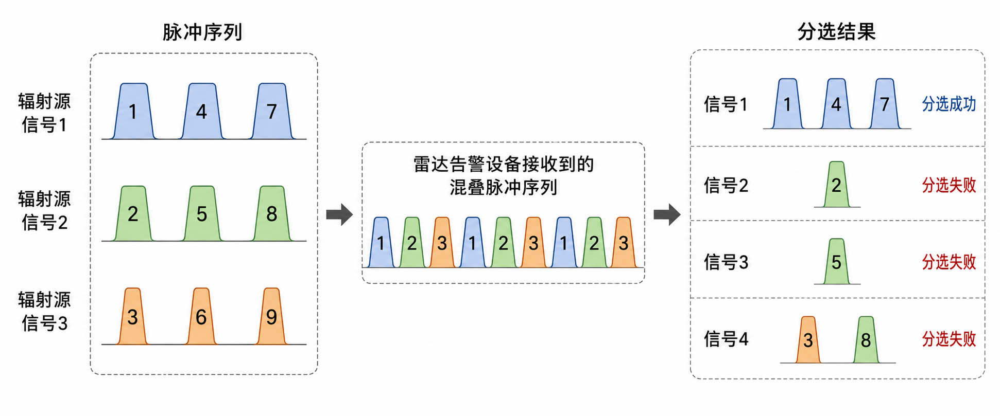

# Radar Pulse Deinterleaving Resources

<p align="center">
  <a href="./README.md">简体中文</a> |
  <b>English</b>
</p>

This repository is curated by **SmartDSP Lab, School of Informatics, Xiamen University**. It collects high-value public resources related to **Radar Pulse Deinterleaving / Radar Signal Sorting**, with a focus on task definitions, PDW datasets, reproducible experimental frameworks, representative methods, and evaluation metrics.

This resource list prioritizes entries that are highly relevant to radar pulse deinterleaving, have clear task definitions, provide public data or code, are supported by papers, or have strong reproducibility value. Projects that are only loosely related by name, poorly documented, difficult to reproduce, or unsuitable as formal research resources are not included in the main recommendations.

The goal of radar pulse deinterleaving is to separate an interleaved pulse stream into groups corresponding to different radar emitters. In a typical **PDW (Pulse Description Word)** setting, each pulse is usually described by parameters such as **TOA (Time of Arrival)**, **PRI (Pulse Repetition Interval)**, **RF/CF (Radio Frequency / Carrier Frequency)**, **PW (Pulse Width)**, **PA (Pulse Amplitude)**, and **DOA/AOA (Direction / Angle of Arrival)**.

---

## Highlights

* **Recommended benchmark:** [Turing Deinterleaving Challenge](https://github.com/alan-turing-institute/turing-deinterleaving-challenge) and [Turing Synthetic Radar Dataset / TSRD](https://huggingface.co/datasets/alan-turing-institute/turing-synthetic-radar-dataset).
* **Recommended baseline:** The HDBSCAN baseline provided by the Turing Challenge, which is a suitable starting point for strictly unsupervised radar pulse deinterleaving.
* **Strictly unsupervised deinterleaving:** Traditional clustering methods such as DBSCAN, HDBSCAN, hierarchical clustering, K-means, and GMM best match the definition of emitter clustering with an unknown number of emitters.
* **Deep learning methods:** Transformer-based metric learning, deep contrastive clustering, semantic segmentation, and graph convolutional networks are valuable research directions, but most of them rely on labeled training data and are better treated as representative methods or upper-bound references.
* **Public data availability:** Public real-world radar PDW / IQ datasets for deinterleaving are still limited. Most reproducible experiments currently rely on synthetic PDW datasets.

---

## Table of Contents

* [1. Task Overview](#1-task-overview)
  * [1.1 What is radar pulse deinterleaving?](#11-what-is-radar-pulse-deinterleaving)
  * [1.2 Common input features](#12-common-input-features)
  * [1.3 Common evaluation metrics](#13-common-evaluation-metrics)
* [2. Method Taxonomy and Task Boundary](#2-method-taxonomy-and-task-boundary)
  * [2.1 Overview of method families](#21-overview-of-method-families)
  * [2.2 Relationship with strictly unsupervised deinterleaving](#22-relationship-with-strictly-unsupervised-deinterleaving)
* [3. Datasets and Benchmarks](#3-datasets-and-benchmarks)
  * [3.1 Dataset overview](#31-dataset-overview)
  * [3.2 Turing Synthetic Radar Dataset / TSRD](#32-turing-synthetic-radar-dataset--tsrd)
  * [3.3 RadSeg](#33-radseg)
* [4. Representative Methods and Papers](#4-representative-methods-and-papers)
  * [4.1 Paper overview](#41-paper-overview)
  * [4.2 Method summaries](#42-method-summaries)
* [5. Recommended Experimental Setup](#5-recommended-experimental-setup)
  * [5.1 Main benchmark](#51-main-benchmark)
  * [5.2 Suggested baselines](#52-suggested-baselines)
  * [5.3 Suggested workflow](#53-suggested-workflow)
* [6. Non-Core Resources](#6-non-core-resources)
* [7. Notes](#7-notes)
* [8. Citation and Contribution](#8-citation-and-contribution)

---

## 1. Task Overview

### 1.1 What is radar pulse deinterleaving?

Radar pulse deinterleaving, also known as **radar signal sorting**, refers to the process of separating an interleaved pulse sequence received in a complex electromagnetic environment into groups corresponding to different radar emitters.

<p align="center">
  
</p>

<p align="center">
  <b>Figure 1.</b> Illustration of the radar pulse deinterleaving task. Pulse sequences from multiple emitters are received as an interleaved pulse stream by an electronic support system, and the deinterleaving algorithm needs to separate them into pulse clusters corresponding to different emitters.
</p>

Given an interleaved pulse sequence:

```text
P = {p1, p2, ..., pN}
```

each pulse `pi` can usually be represented as a PDW feature vector:

```text
pi = [TOA, RF/CF, PW, PA, DOA/AOA, ...]
```

The goal of deinterleaving is to output a partition:

```text
C = {C1, C2, ..., CK}
```

where each cluster `Ck` corresponds to a radar emitter.

Strictly speaking, radar pulse deinterleaving can be regarded as an **unsupervised clustering problem**:

* the number of emitters is usually unknown;
* emitter identities are not fixed classes;
* pulses from the same emitter should be assigned to the same group;
* pulses from different emitters should be separated.

At the same time, many modern methods formulate the task as supervised learning, semi-supervised learning, metric learning, sequence labeling, or semantic segmentation. These methods can produce deinterleaving-style outputs, but they are not necessarily strictly unsupervised clustering methods.

---

### 1.2 Common input features

| Feature | Meaning | Usage |
| --- | --- | --- |
| TOA | Time of Arrival | Used to compute PRI and analyze temporal patterns |
| PRI / DTOA | Pulse Repetition Interval / Difference of TOA | Core features for traditional deinterleaving methods |
| RF / CF | Radio Frequency / Carrier Frequency | Used to distinguish fixed-frequency or frequency-agile radars |
| PW | Pulse Width | Helps distinguish emitters with different waveform parameters |
| PA / AMP | Pulse Amplitude | Useful auxiliary feature, but sensitive to propagation paths and receiver effects |
| DOA / AOA | Direction / Angle of Arrival | A strong spatial discriminative feature when available |

---

### 1.3 Common evaluation metrics

| Metric | Description |
| --- | --- |
| V-measure | Harmonic mean of homogeneity and completeness |
| Homogeneity | Whether each predicted cluster mainly contains pulses from a single true emitter |
| Completeness | Whether pulses from the same true emitter are completely assigned to the same predicted cluster |
| ARI | Adjusted Rand Index |
| AMI | Adjusted Mutual Information |
| Pairwise F1 | F1 score obtained by treating whether two pulses belong to the same emitter as a binary decision |
| MCC | Matthews Correlation Coefficient, which can be used for pairwise matching evaluation |

---

## 2. Method Taxonomy and Task Boundary

This section summarizes common technical routes for radar pulse deinterleaving and clarifies their relationship with the standard definition of **radar pulse deinterleaving / emitter clustering**. The taxonomy is not an open-source resource list; later tables only include resources with clear paper, dataset, or project links.

### 2.1 Overview of method families

| Method Family | Task Fit | Description |
| --- | --- | --- |
| PRI-based traditional methods | High | Traditional radar pulse deinterleaving methods that mainly use TOA / PRI periodic structures, such as PRI histogram, CDIF, SDIF, and PRI transform |
| Classical clustering | High | K-means, GMM, DBSCAN, HDBSCAN, hierarchical clustering, and related methods that can be directly applied to PDW feature clustering |
| Density-based clustering baselines | High | HDBSCAN / DBSCAN are suitable for unknown-cluster-number settings and are commonly used baselines in unsupervised deinterleaving experiments |
| Metric learning + clustering | Medium to high | Learn pulse embeddings using supervised or weakly supervised signals, then cluster in the learned feature space |
| Optimal transport based clustering | Medium to high | First over-segment the pulses, then merge clusters using distributional distances or optimal transport distances |
| Contrastive / representation learning | Medium | Improve feature separability using contrastive learning, autoencoders, or representation learning; the exact task setting should be checked case by case |
| Sequence labeling / semantic segmentation | Medium | Formulate deinterleaving as sequence labeling or semantic segmentation, usually requiring labeled training data |
| Radar activity segmentation | Related task | Focuses on radar activity detection or segmentation, and is not equivalent to standard PDW emitter clustering |

### 2.2 Relationship with strictly unsupervised deinterleaving

| Method Family | Strictly Unsupervised? | Description |
| --- | --- | --- |
| DBSCAN / HDBSCAN | Yes | Do not require predefined emitter class labels and are suitable for unknown-emitter-number settings |
| K-means / GMM | Yes | Unsupervised clustering methods, but usually require a predefined or estimated number of clusters K |
| Hierarchical clustering | Yes | Suitable for constructing hierarchical pulse similarity structures; pruning criteria strongly affect results |
| PRI histogram / CDIF / SDIF / PRI transform | Mostly yes | Traditional model-driven methods, suitable for pulse sequences with clear PRI structures |
| Optimal transport based clustering | Mostly yes | Mainly based on unsupervised clustering and cluster merging, suitable for complex PDW distributions |
| Metric learning + clustering | No | Usually uses labels during training; inference can output emitter groups via clustering |
| Contrastive learning + clustering | Depends on the setting | Self-supervised settings can be close to unsupervised deinterleaving, while supervised contrastive learning is not strictly unsupervised |
| Semantic segmentation / sequence labeling | No | Usually relies on dense labels and belongs to supervised deinterleaving modeling |
| Radar activity segmentation | No | Mainly addresses radar activity detection or segmentation, rather than standard emitter clustering |

---

## 3. Datasets and Benchmarks

### 3.1 Dataset overview

| Dataset | Task Fit | Data Type | Labels | Open Source | Rating | Notes |
| --- | --- | --- | --- | --- | --- | --- |
| [Turing Synthetic Radar Dataset / TSRD](https://huggingface.co/datasets/alan-turing-institute/turing-synthetic-radar-dataset) | Standard PDW pulse deinterleaving | Synthetic PDW pulse trains | Emitter labels | Yes, access requires accepting the Hugging Face dataset conditions | ⭐⭐⭐⭐⭐ | Recommended as the main benchmark |
| [RadSeg](https://github.com/abcxyzi/radseg) | Related task: radar activity segmentation | Complex baseband IQ sequences + sample-wise masks | Segmentation masks | Yes | ⭐⭐ | A formal dataset, but not a standard PDW emitter clustering dataset |

---

### 3.2 Turing Synthetic Radar Dataset / TSRD

**Rating:** ⭐⭐⭐⭐⭐  
**Task:** Radar pulse deinterleaving / PDW emitter clustering  
**Data type:** Synthetic PDW pulse trains  
**Labels:** Emitter labels  
**Project:** [Turing Deinterleaving Challenge](https://github.com/alan-turing-institute/turing-deinterleaving-challenge)

TSRD is one of the most suitable public datasets for radar pulse deinterleaving benchmarking. It is designed for interleaved radar pulse trains and provides PDW sequences, emitter labels, stare / scan receiver modes, and an accompanying evaluation framework.

**Why it is recommended:**

* The task definition is clear and directly targets radar pulse deinterleaving;
* The dataset is large enough for unsupervised, semi-supervised, and supervised evaluation;
* Ground-truth emitter labels are provided, enabling metrics such as V-measure, ARI, AMI, homogeneity, and completeness;
* It is paired with the Turing Deinterleaving Challenge, making baseline reproduction convenient;
* It is suitable as a main benchmark for new methods.

**Usage notes:**

* The data are synthetic and should not be treated as real measured radar PDWs;
* The dataset files are large and require sufficient storage and computing resources;
* When supervised models are trained on the data, the difference between supervised learning and strictly unsupervised deinterleaving should be clearly stated.

---

### 3.3 RadSeg

**Rating:** ⭐⭐  
**Task:** Radar pulse activity segmentation  
**Data type:** Complex baseband IQ samples  
**Labels:** Channel-wise segmentation masks  
**Repository:** [RadSeg](https://github.com/abcxyzi/radseg)

RadSeg is a dataset for radar activity detection and segmentation. It provides IQ sequences and sample-wise segmentation masks. Although it is related to radar signal analysis, its task objective is not standard PDW emitter clustering.

**Why it is retained:**

* It is a formal dataset with paper support;
* Its data and task descriptions are relatively complete;
* It is useful for studies based on raw IQ signals or segmentation-style modeling.

**Task boundary:**

* RadSeg addresses radar pulse activity segmentation, not PDW emitter clustering;
* Its labels are segmentation masks, rather than emitter-level pulse labels;
* It is not suitable for direct comparison with standard deinterleaving datasets such as TSRD.

---

## 4. Representative Methods and Papers

This section summarizes representative methods with clear paper sources. The code / project column only lists public projects provided by the paper authors, dataset maintainers, or official challenge organizers.

Among them, **Turing Synthetic Radar Dataset / Turing Deinterleaving Challenge** provides a paper, dataset, baseline code, and evaluation framework, making it the most suitable starting point for reproducible experiments. Therefore, this section gives separate descriptions for this resource and its HDBSCAN baseline.

### 4.1 Paper overview

| Method / Direction | Representative Paper | Paper Link | Code / Project | Task Fit | Description |
| --- | --- | --- | --- | --- | --- |
| Benchmark / Dataset | The Turing Synthetic Radar Dataset: A Dataset for Pulse Deinterleaving | [arXiv](https://arxiv.org/abs/2602.03856) / [Dataset](https://huggingface.co/datasets/alan-turing-institute/turing-synthetic-radar-dataset) | [GitHub](https://github.com/alan-turing-institute/turing-deinterleaving-challenge) | High | Provides data, labels, evaluation metrics, and an official baseline; suitable as the main benchmark |
| HDBSCAN baseline | Turing Deinterleaving Challenge baseline | [Project](https://github.com/alan-turing-institute/turing-deinterleaving-challenge) | [GitHub](https://github.com/alan-turing-institute/turing-deinterleaving-challenge) | High | Official reproducible unsupervised baseline based on density clustering over PDW features |
| Transformer metric learning | Radar Pulse Deinterleaving with Transformer Based Deep Metric Learning | [arXiv](https://arxiv.org/abs/2503.13476) | Paper only, no open-source code | High | Uses Transformer + triplet loss to learn pulse embeddings for emitter clustering during inference |
| Optimal transport clustering | Deinterleaving RADAR Emitters with Optimal Transport Distances | [arXiv](https://arxiv.org/abs/2312.11178) | Paper only, no open-source code | High | Unsupervised clustering plus optimal transport based cluster merging for complex PDW distributions |
| Renewal process mixture | Deinterleaving of Mixtures of Renewal Processes | [DOI](https://doi.org/10.1109/TSP.2018.2886149) | Paper only, no open-source code | Medium to high | Models pulse train deinterleaving from the perspective of mixture renewal processes |
| Discrete renewal process mixture | Deinterleaving of Discrete Renewal Process Mixtures with Application to Electronic Support Measures | [arXiv](https://arxiv.org/abs/2402.09166) / [DOI](https://doi.org/10.1109/TSP.2024.3464753) | Paper only, no open-source code | Medium to high | Discrete renewal Markov-chain deinterleaving method for electronic support measures |
| Deep contrastive clustering | Deep Contrastive Clustering for Signal Deinterleaving | [DOI](https://doi.org/10.1109/TAES.2023.3322971) | Paper only, no open-source code | Medium to high | Supports the contrastive learning + clustering direction |
| Semantic segmentation deinterleaving | A Radar Signal Deinterleaving Method Based on Semantic Segmentation with Neural Network | [arXiv](https://arxiv.org/abs/2110.13706) / [DOI](https://doi.org/10.1109/TSP.2022.3229630) | Paper only, no open-source code | Medium | Formulates deinterleaving as sequence semantic labeling / segmentation, usually requiring labeled training data |
| Image segmentation deinterleaving | Image Segmentation for Radar Signal Deinterleaving Using Deep Learning | [DOI](https://doi.org/10.1109/TAES.2022.3188225) | Paper only, no open-source code | Medium | Converts radar pulse sequences into image representations and performs deinterleaving via image segmentation |
| Sep-RefineNet | Sep-RefineNet: A Deinterleaving Method for Radar Signals Based on Semantic Segmentation | [Paper](https://www.mdpi.com/2076-3417/13/4/2726) | Paper only, no open-source code | Medium | Constructs a frequency characteristic matrix and uses a semantic segmentation network for pulse-stream position decoding |
| Deep ToA mask | Deep ToA Mask-Based Recursive Radar Pulse Deinterleaving | [DOI](https://doi.org/10.1109/TAES.2022.3193948) | Paper only, no open-source code | Medium to high | Uses ToA masks and recursive separation to deinterleave interleaved pulse sequences |
| GCN semi-supervised sorting | Radar Signal Sorting via Graph Convolutional Network and Semi-Supervised Learning | [DOI](https://doi.org/10.1109/LSP.2024.3519884) | Paper only, no open-source code | Medium | Semi-supervised graph-learning-based radar signal sorting; not strictly unsupervised clustering |

---

### 4.2 Method summaries

#### 4.2.1 Turing Synthetic Radar Dataset / Turing Deinterleaving Challenge

Turing Synthetic Radar Dataset / TSRD is one of the most suitable public benchmarks for radar pulse deinterleaving. The dataset uses PDW pulse sequences as input and provides emitter labels, making it possible to evaluate whether an algorithm can separate an interleaved pulse stream into clusters corresponding to different emitters.

Unlike resources that only provide data files, the Turing Deinterleaving Challenge also provides data usage instructions, an evaluation pipeline, and an HDBSCAN baseline. This makes it a practical platform for reproducible experiments. New methods can be compared with the official baseline or self-implemented clustering methods under the same data split, evaluation protocol, and metric set.

**Reproducibility value:**

* The dataset, task definition, and evaluation metrics are relatively complete;
* Stare / scan receiver modes are provided, enabling robustness testing under different observation conditions;
* Emitter labels are available for computing clustering metrics such as V-measure, ARI, AMI, homogeneity, completeness, and Pairwise F1;
* The official project includes an HDBSCAN baseline, which can serve as the starting point for unsupervised method reproduction;
* The framework can be extended to DBSCAN, K-means, GMM, hierarchical clustering, and representation-learning-plus-clustering methods.

**Suggested usage:**

1. First reproduce the HDBSCAN baseline in the Turing Challenge to verify data loading, feature normalization, clustering, and evaluation;
2. Add basic clustering methods such as DBSCAN, K-means, GMM, and hierarchical clustering to build a baseline table;
3. For deep representation learning, use HDBSCAN or hierarchical clustering on the learned PDW embeddings for cluster assignment;
4. When reporting results, include the receiver mode, input features, whether labels are used for training, whether the number of emitters is predefined, and the main clustering metrics.

#### 4.2.2 HDBSCAN baseline

HDBSCAN is the main unsupervised baseline provided by the Turing Deinterleaving Challenge. It performs density-based clustering directly in the PDW feature space and does not require specifying the number of emitters in advance. Therefore, it is well aligned with the setting of unsupervised deinterleaving with an unknown number of emitters.

Compared with K-means and GMM, HDBSCAN does not require the number of clusters to be specified beforehand and can identify low-density or unstable samples as noise. Compared with standard DBSCAN, HDBSCAN is more adaptive to clusters with different densities. This is important for radar pulse deinterleaving because the number of pulses, parameter distributions, and local densities may vary significantly across different emitters.

**Reproduction and extension suggestions:**

* When using raw PDW features, feature normalization should be applied first to avoid scale differences among TOA, RF, PW, and PA affecting the distance metric;
* Comparative experiments can include DBSCAN, K-means, GMM, and hierarchical clustering to distinguish methods that handle unknown cluster numbers from those that require a given K;
* If a deep model is used to learn embeddings, HDBSCAN can still be kept as a unified clustering backend, making it easier to determine whether performance gains come from representation learning or the clustering algorithm itself;
* When reporting HDBSCAN results, key hyperparameters and the proportion of noise points should be recorded, and evaluation metrics should be consistent with the Turing Challenge.

#### 4.2.3 Transformer metric learning

“Radar Pulse Deinterleaving with Transformer Based Deep Metric Learning” defines radar pulse deinterleaving as separating an interleaved pulse sequence by emitter and emphasizes that the number of emitters in a single pulse train is unknown. The method uses a Transformer to encode PDW sequences and learns pulse embeddings with triplet loss, pulling pulses from the same emitter closer in the feature space and pushing pulses from different emitters apart. This direction is a representative example of supervised metric learning followed by clustering.

#### 4.2.4 Optimal transport clustering

“Deinterleaving RADAR Emitters with Optimal Transport Distances” proposes an unsupervised deinterleaving method. The basic idea is to first over-segment the pulses to reduce the risk of incorrectly merging pulses from different emitters. Since a complex emitter may correspond to multiple clusters, the method then performs hierarchical cluster merging using optimal transport distances. This direction is useful for supporting the idea of unsupervised clustering plus cluster merging.

#### 4.2.5 Renewal process mixture methods

“Deinterleaving of Mixtures of Renewal Processes” and “Deinterleaving of Discrete Renewal Process Mixtures with Application to Electronic Support Measures” both address deinterleaving from the perspective of stochastic process mixture modeling. Instead of simply clustering in the PDW feature space, these methods model interleaved pulse sequences using time-of-arrival information, symbolic sequences, and renewal process / Markov-chain structures. They are suitable references for statistical modeling based deinterleaving methods.

#### 4.2.6 Deep contrastive clustering

“Deep Contrastive Clustering for Signal Deinterleaving” is a representative paper for the contrastive learning plus clustering direction. The core idea is to enhance the separability of signal or pulse representations using contrastive learning, and then perform deinterleaving using clustering or pseudo-label mechanisms. This method is better placed under deep representation learning based deinterleaving methods rather than under open-source frameworks or benchmarks.

#### 4.2.7 Semantic segmentation deinterleaving

“A Radar Signal Deinterleaving Method Based on Semantic Segmentation with Neural Network” formulates deinterleaving as a semantic segmentation / sequence labeling problem. Its input mainly involves DTOA-like time-difference sequences, and a neural network assigns semantic labels to pulses in the pulse stream to complete deinterleaving. This type of method is suitable for complex PRI modulation scenarios, but usually relies on labeled training data and is therefore not a strictly unsupervised clustering method.

#### 4.2.8 Image segmentation deinterleaving

“Image Segmentation for Radar Signal Deinterleaving Using Deep Learning” transforms radar pulse sequences into image-like representations and then applies deep image segmentation models for deinterleaving. Its value lies in converting pulse deinterleaving from a traditional PRI-search problem into a two-dimensional image segmentation problem, although its task formulation and input representation differ from direct PDW clustering.

#### 4.2.9 Sep-RefineNet

Sep-RefineNet is a semantic-segmentation-based deinterleaving method. It constructs a frequency characteristic matrix to represent the semantic structure of different radar pulse streams, applies Sep-RefineNet for pixel-level segmentation, and finally recovers pulse positions in the original pulse stream through position decoding and verification. This method belongs to segmentation-based deinterleaving and should not be treated as an unsupervised clustering baseline.

#### 4.2.10 Deep ToA mask recursive deinterleaving

“Deep ToA Mask-Based Recursive Radar Pulse Deinterleaving” uses ToA masks and recursive separation to process interleaved radar pulse sequences. It focuses on gradually extracting pulse subsequences corresponding to different emitters from the time-of-arrival structure, making it suitable for the category of deep recursive or mask-based deinterleaving methods.

#### 4.2.11 GCN semi-supervised radar signal sorting

“Radar Signal Sorting via Graph Convolutional Network and Semi-Supervised Learning” uses graph convolutional networks and semi-supervised learning to model radar signal sorting. This direction is suitable for describing the use of pulse relation graphs, pseudo-labels, and semi-supervised learning in signal sorting, but it is not a strictly unsupervised PDW emitter clustering method.

---

## 5. Recommended Experimental Setup

For **unsupervised radar pulse deinterleaving**, it is recommended to use TSRD and the Turing Deinterleaving Challenge as the main experimental platform, and to build reproducible comparisons around the HDBSCAN baseline.

### 5.1 Main benchmark

**Turing Synthetic Radar Dataset / TSRD** is recommended as the main benchmark. It provides PDW pulse sequences, emitter labels, and an evaluation pipeline, making it suitable for comparing classical clustering methods, representation learning methods, and supervised upper-bound models.

The experimental setup should clearly specify:

* the receiver mode used, such as stare or scan;
* the input feature set, such as TOA, CF/RF, PW, PA, and AoA;
* whether emitter labels are used during training;
* whether the number of emitters K is predefined;
* the clustering method, distance metric, and key hyperparameters;
* whether features such as TOA, RF, PW, and PA are standardized or transformed.

### 5.2 Suggested baselines

| Category | Methods | Purpose |
| --- | --- | --- |
| Official baseline | HDBSCAN | Reproduce the basic Turing Challenge results |
| Raw-feature clustering | DBSCAN, K-means, GMM, hierarchical clustering | Evaluate classical clustering methods on raw PDW features |
| PRI-based methods | PRI histogram, CDIF, SDIF, PRI transform | Compare traditional time-structure-based deinterleaving methods |
| Hybrid methods | RF/PW/DOA coarse clustering + PRI refinement | Evaluate the combination of multi-feature coarse grouping and PRI-based refinement |
| Representation learning | Autoencoder / contrastive encoder + HDBSCAN | Evaluate whether learned embeddings improve clustering separability |
| Supervised upper bounds | Transformer metric learning, GCN, TCN, sequence labeling models | Provide performance references for supervised or semi-supervised methods |

### 5.3 Suggested workflow

```text
Raw PDW sequence
      ↓
Feature selection and normalization
      ↓
Optional temporal feature construction
      ↓
Clustering or representation learning
      ↓
Cluster label assignment
      ↓
Evaluation using V-measure / ARI / AMI / Pairwise F1
```

For unsupervised methods, it is recommended to first reproduce `raw PDW features + HDBSCAN`, and then gradually add new feature construction strategies, clustering methods, or representation learning modules. This helps avoid situations where it is unclear whether improvements come from better features, a better clustering strategy, or a more complex model.

---

## 6. Non-Core Resources

To keep this resource list focused, the following resources are not included in the core recommendations. Some of them are related to radar signal processing, but they are not listed in the main tables due to task mismatch, insufficient documentation, limited reproducibility value, or unsuitable project quality for formal research use.

| Resource | Decision | Reason |
| --- | --- | --- |
| Stream-ConAEnet | Not included in the main recommendations | The project description indicates that it is an undergraduate thesis project; data descriptions, running instructions, evaluation protocol, and paper support are insufficient |
| EW Signal Intelligence Deinterleaving Demo | Not included in the main recommendations | A small educational demo that may help explain the concept, but is not suitable as a research-level benchmark or representative method |
| radar_data_Kmeans | Not included as a core resource | Related to radar deinterleaving, but documentation, evaluation protocol, and data descriptions are weak; can be used as an engineering implementation clue |
| HMC-RFN GitHub repository | Not included as a core resource | Contains MATLAB code, but the README and reproduction instructions are limited; can be used as a clue to paper-related code |
| 2nd-EBDSC repository | Not included as a core resource | Contains relatively complete engineering content, but the task is closer to competition-style supervised sequence modeling or template-assisted signal extraction, rather than standard unsupervised PDW emitter clustering |

---

## 7. Notes

* Compared with general RF modulation recognition or RF fingerprinting, high-quality open resources for radar pulse deinterleaving are still limited;
* Most public datasets are synthetic, because real radar PDW or IQ data are difficult to release and reliable ground-truth labels are hard to obtain;
* When reporting experimental results, clearly state whether the method is unsupervised, supervised, semi-supervised, or “supervised representation learning followed by clustering”;
* For strictly unsupervised radar pulse deinterleaving, TSRD + HDBSCAN / DBSCAN / K-means / hierarchical clustering is currently one of the most transparent and reproducible starting points;
* The ratings in this repository are subjective assessments by the curators based on task relevance, resource quality, reproducibility value, and completeness of data descriptions. They do not represent GitHub stars.

---

## 8. Citation and Contribution

This resource list is curated and maintained by **SmartDSP Lab, School of Informatics, Xiamen University**. It aims to provide a systematic, reproducible, and extensible open resource index for radar pulse deinterleaving, radar signal sorting, PDW data processing, and related intelligent electromagnetic signal processing research.

If this repository is helpful for your research or project, please consider citing this resource list and, whenever possible, also cite the original papers, datasets, and code repositories.

### Citation

If you use this curated resource list, you may cite it as:

```bibtex
@misc{smartdsp_radar_deinterleaving_resources,
  title        = {Radar Pulse Deinterleaving Resources},
  author       = {SmartDSP Lab, School of Informatics, Xiamen University},
  year         = {2026},
  howpublished = {\url{https://github.com/your-repository-url}},
  note         = {A curated resource list for radar pulse deinterleaving and radar signal sorting}
}
```

Please replace `https://github.com/your-repository-url` with the actual GitHub URL of this repository.

### Contribution

Researchers and developers are welcome to contribute through issues or pull requests. Contributions may include, but are not limited to:

* newly released radar pulse deinterleaving datasets;
* open-source implementations of PRI-based, clustering-based, or deep-learning-based deinterleaving methods;
* reproducible benchmark results;
* links to public papers, code, and datasets;
* corrections to resource availability, task definitions, or ratings;
* additional notes on whether a method strictly matches the definition of unsupervised radar pulse deinterleaving.

When submitting a new resource, please include the following information whenever possible:

```text
Resource name:
Resource link:
Task type:
Method type:
Open-source code:
Open-source data:
Labels available:
Strictly unsupervised:
Reason for recommendation:
Notes:
```

This repository will continue to update public resources related to radar pulse deinterleaving, and contributions from researchers in related fields are welcome.
